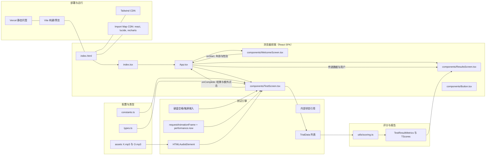
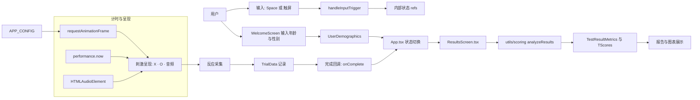

# 组件架构图（Mermaid）

```mermaid
flowchart LR
    
  subgraph 客户端[浏览器前端（React SPA）]
    index_html[index.html]
    index_tsx[index.tsx]
    app_tsx[App.tsx]
    welcome[components/WelcomeScreen.tsx]
    test[components/TestScreen.tsx]
    results[components/ResultsScreen.tsx]
    button[components/Button.tsx]
  end

  subgraph 配置与类型
    constants_ts[constants.ts]
    types_ts[types.ts]
    assets_mp3[assets X.mp3 与 O.mp3]
  end

  subgraph 测试引擎
    input[键盘空格/触屏输入]
    timing[requestAnimationFrame + performance.now]
    audio[HTMLAudioElement]
    game_state[内部状态引用]
    trials[TrialData 列表]
  end

  subgraph 评分与报告
    scoring_ts[utils/scoring.ts]
    metrics[TestResultMetrics 与 TScores]
  end

  subgraph 部署与运行
    tailwind[Tailwind CDN]
    importmap[Import Map CDN: react, lucide, recharts]
    vite[Vite 构建/预览]
    vercel[Vercel 静态托管]
  end

  index_html --> index_tsx --> app_tsx
  app_tsx --> welcome
  app_tsx --> test
  app_tsx --> results
  welcome -->|onStart: 年龄与性别| app_tsx
  test -->|onComplete: 结果与额外点击| app_tsx
  app_tsx -->|传递数据与用户| results

  constants_ts --> test
  types_ts --> test
  assets_mp3 --> audio

  input --> test
  timing --> test
  audio --> test
  test --> trials
  trials --> scoring_ts
  scoring_ts --> metrics
  metrics --> results

  index_html --- tailwind
  index_html --- importmap
  vite --- index_html
  vercel --- vite
```

# 数据流架构图（Mermaid）

```mermaid
flowchart LR
  user[用户] --> input[输入: Space 或 触屏]
  input --> handler[handleInputTrigger]
  handler --> state[内部状态 refs]

  subgraph 计时与呈现
    raf[requestAnimationFrame]
    perf[performance.now]
    stim[刺激呈现: X · O · 音频]
    audio[HTMLAudioElement]
  end

  appcfg[APP_CONFIG] --> raf
  raf --> stim
  perf --> stim
  audio --> stim

  stim --> response[反应采集]
  response --> trial[TrialData 记录]
  trial --> complete[完成回调: onComplete]
  complete --> app[App.tsx 状态切换]
  app --> results[ResultsScreen.tsx]
  results --> scoring[utils/scoring analyzeResults]
  scoring --> metrics[TestResultMetrics 与 TScores]
  metrics --> report[报告与图表展示]

  user --> welcome[WelcomeScreen 输入年龄与性别]
  welcome --> demographics[UserDemographics]
  demographics --> app
```
